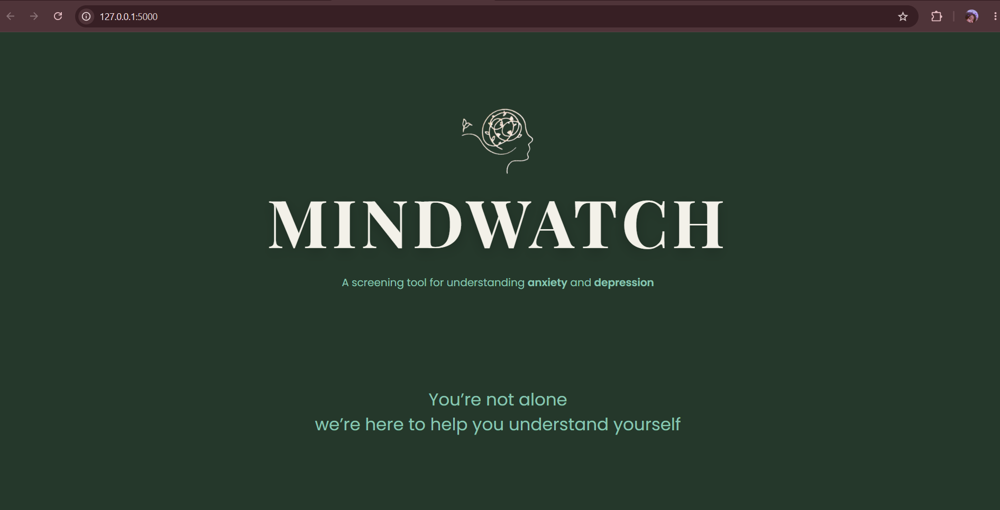
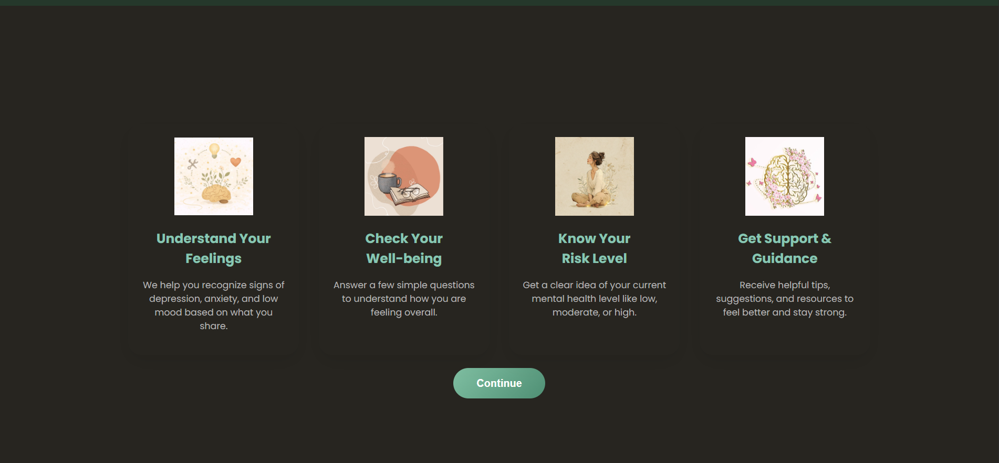
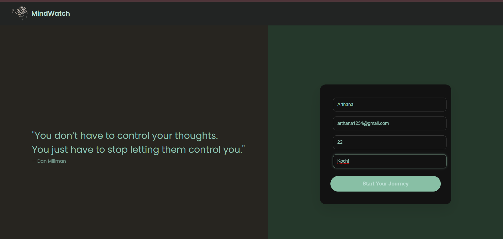
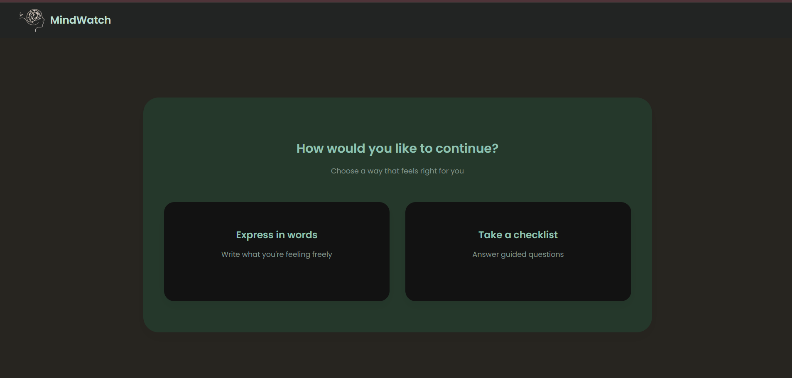
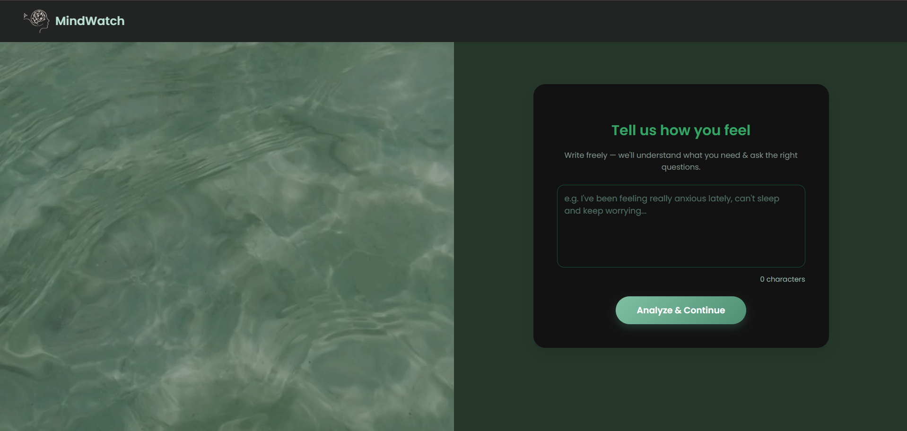
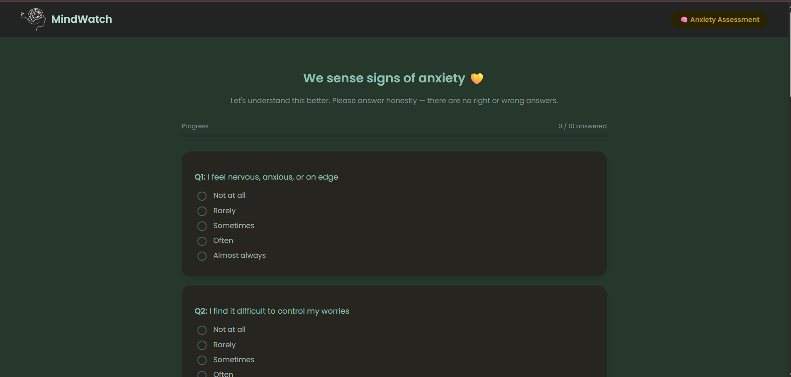
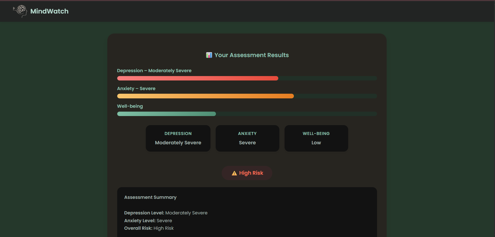
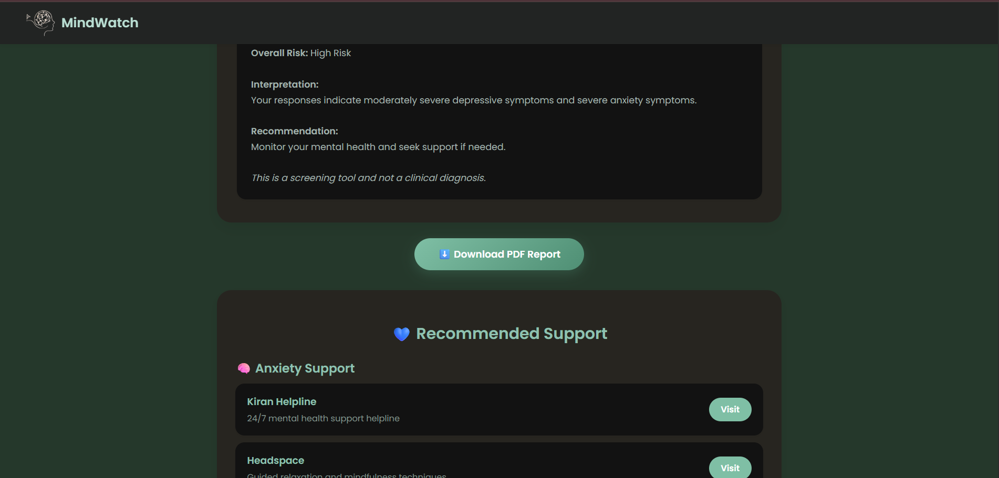
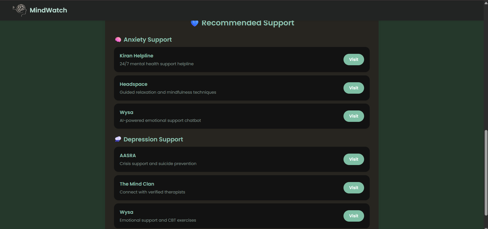
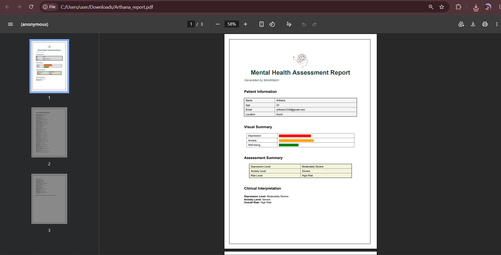

# 🧠 MindWatch

A web-based mental health screening tool that helps users identify potential signs of anxiety and depression through guided questionnaires and free-text responses.

> **Disclaimer:** This is a screening tool and not a substitute for professional medical diagnosis.

---

## ✨ Features

- Free-text emotion analysis
- Dynamic mental health questionnaire
- Anxiety & Depression assessment
- Risk level prediction
- Personalized support resources
- Downloadable PDF report
- Responsive and user-friendly interface

---

## 🛠️ Tech Stack

- Python
- Flask
- HTML
- CSS
- JavaScript
- Scikit-learn
- TF-IDF Vectorizer
- Logistic Regression
- ReportLab

---

# 📸 Screenshots

## Landing Page

---

## Features

---

## User Details

---

## Assessment Mode

---

## Text Analysis

---

## Anxiety Questionnaire

---

## Assessment Results

---

## Detailed Result

---

## Recommended Support

---

## Downloadable PDF Report

---

## 🚀 Future Enhancements

- User authentication
- Assessment history
- Progress tracking
- Better prediction model
- Cloud deployment

---

## 👩‍💻 Developed By

**Arthana Sreekesh(TEAM LEAD), Arsha Biju Thottathil, Hridhya Sara Sunil**
